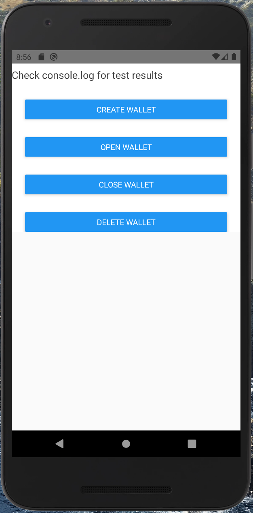
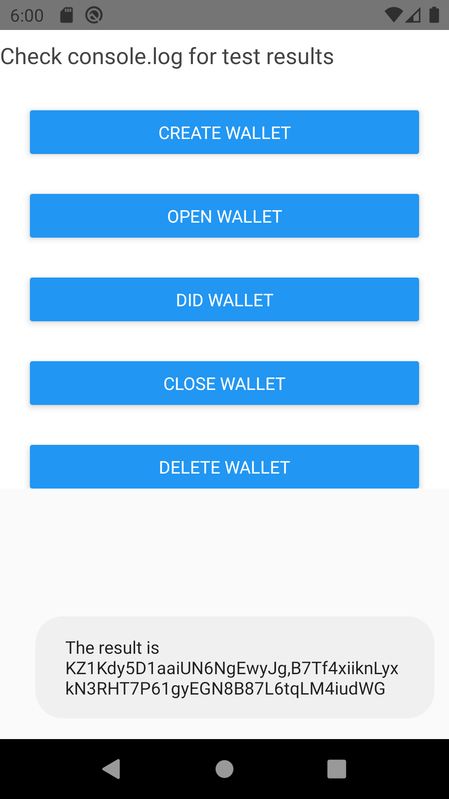

# Installation

```
yarn
```

# Running on Simulator/Emulator

The app currently works only on Android, because of missing native Indy library for iOS. If you want to try it on iOS you would need to add Indy.framework as a dependency to the iOS project.

## Android

```
yarn android
```

You shoud see following screen when app starts:



You have to click on buttons in the right order, otherwise, you'll get an error (if you try to close wallet that has not been open yet, for example). Check the console for the result of every step.

After clicking `DID Wallet` button, you would see the following:


